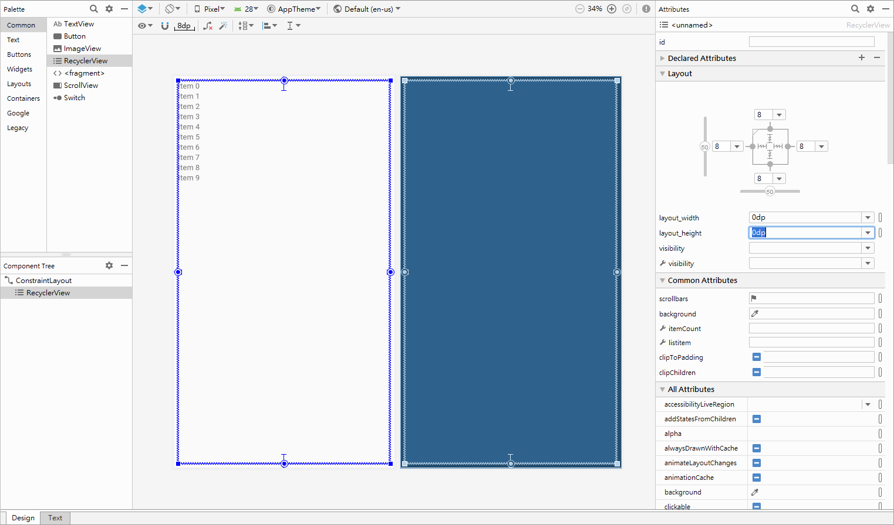
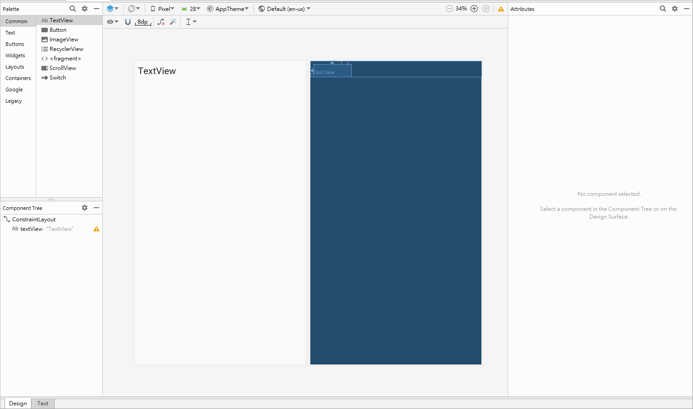

# Android 清單顯示元件 RecyclerView

## RecyclerView 基本使用

### 在畫面中拉入 RecyclerView



### 再設計一個 Item 的 Layout



```xml
<?xml version="1.0" encoding="utf-8"?>
<android.support.constraint.ConstraintLayout
        xmlns:android="http://schemas.android.com/apk/res/android"
        xmlns:app="http://schemas.android.com/apk/res-auto"
        android:layout_width="match_parent"
        android:layout_height="wrap_content">
    <TextView
            android:text="TextView"
            android:layout_width="wrap_content"
            android:layout_height="wrap_content"
            android:id="@+id/textView" android:layout_marginTop="8dp"
            app:layout_constraintTop_toTopOf="parent" app:layout_constraintStart_toStartOf="parent"
            android:layout_marginStart="8dp" android:textAppearance="@style/TextAppearance.AppCompat.Large"/>
</android.support.constraint.ConstraintLayout>
```

務必記得將 ConstraintLayout 的 layout_height 設定為 wrap_content，以免出現一頁只有一個 Item 的問題，有時很難發現這個 Bug。

### 設計 Adapter 和 ViewHolder

建議先設計 ViewHolder 再設計 Adapter 會比較容易

設計為 Activity 的 inner class，就可用 this 取得 Context，還可取得清單資料

### ViewHolder 設計

```kotlin
inner class MyViewHolder(view: View) : RecyclerView.ViewHolder(view) {
    val textView = view.findViewById<TextView>(R.id.textview)

    fun bindView(position: Int) {
        textView.text = items[position].toString()
    }
}
```

### Adapter 設計

```kotlin
inner class MyAdapter : RecyclerView.Adapter<MyViewHolder>() {
    override fun onCreateViewHolder(parent: ViewGroup, viewType: Int): MyViewHolder {
        val view = LayoutInflater.from(parent.context).inflate(
                R.layout.item,
                parent,
                false
            )
        return MyViewHolder(view)
    }

    override fun getItemCount(): Int {
        return items.size
    }

    override fun onBindViewHolder(holder: MyViewHolder, position: Int) {
        holder.bindView(position)
    }
}
```

## RecyclerView 初始化

```kotlin
class MainActivity : AppCompatActivity() {

    override fun onCreate(savedInstanceState: Bundle?) {
        super.onCreate(savedInstanceState)
        setContentView(R.layout.activity_main)

        recycler.apply {
            layoutManager = LinearLayoutManager(this@MainActivity)
            setHasFixedSize(true)
            adapter = MyAdapter()
        }
    }
}
```

## Item 點擊事件設計

```kotlin
override fun onBindViewHolder(holder: MyViewHolder, position: Int) {
    holder.itemView.setOnClickListener{
        //TODO onClick
    }
}
```

hloder 裡的 itemView 可以取得整個 Item 的 View

## Recycler 格狀清單

將 RecyclerView 的 LayoutManger 設定為 GridLayoutManager 即可有格狀清單的效果。

```kotlin
recycler.layoutManager = GridLayoutManager(this@MainActivity, 3)
```

GridLayoutManager( ) 的第二的參數是：每行顯示幾筆資料

## RecyclerView 動態調整 Item 高度

```kotlin
class MyAdapter : RecyclerView.Adapter<MyViewHolder>() {
    override fun onCreateViewHolder(parent: ViewGroup, viewType: Int): MyViewHolder {
        val view = LayoutInflater.from(parent.context).inflate(
                R.layout.item,
                parent,
                false
            )
        view.layoutParams.height = parent.height / 2
        return MyViewHolder(view)
    }
}
```

利用 parent 的高度，動態調整 view 的高度

## 在 Fragment 中使用 RecyclerView

```kotlin
class MYFragment : Fragment() {
    override fun onCreateView(inflater: LayoutInflater, container: ViewGroup?, savedInstanceState: Bundle?) =
        inflater.inflate(R.layout.my_fragment, container, false)

    override fun onActivityCreated(savedInstanceState: Bundle?) {
        super.onActivityCreated(savedInstanceState)
        setRecycler()
    }

    private fun setRecycler() {
        recycler.setHasFixedSize(false)
        recycler.apply {
            setHasFixedSize(true)
            layoutManager = LinearLayoutManager(activity)
            adapter = TransactionAdapter()
        }
    }
}
```

覆寫 onActivityCreated()
