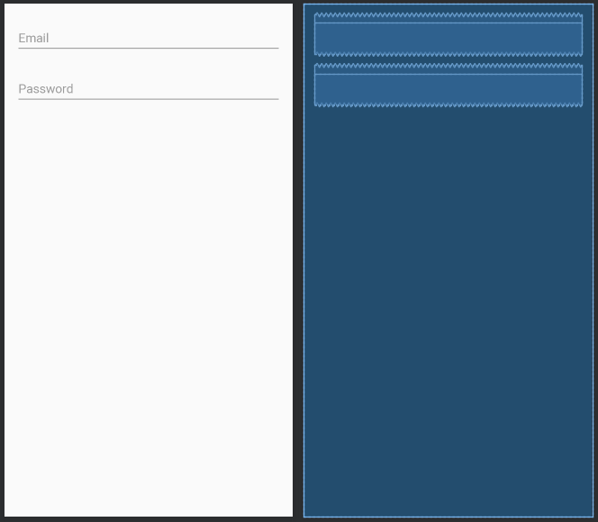

# Android Lifecycle 處理簡介

## 為什麼要使用 ViewModel 和 LiveData

Activity 有自己的命週期，若 Activity 不在畫面上，就沒有必要一直更新資料，或通知 Activity 資料改變，也可將複雜的商業邏輯移出 Activity。以往處理 Activity 的生命週期很麻煩，現在用 ViewModel 和 LiveData，就會自動判斷 Activity 的狀態，並會自動通知 Activity 資料改變。存在 ViewModel 中的資料，如果畫面翻轉，也不會造成資料流失。

## 導入 [Android Lifecycle](https://developer.android.com/jetpack/androidx/releases/lifecycle)

```gradle
dependencies {
    def lifecycle_version = "2.0.0" //最新版本請參考 Android 官網
    // ViewModel and LiveData
    implementation "androidx.lifecycle:lifecycle-extensions:$lifecycle_version"
}
```

## ViewModel LiveData 使用範例

以一個登入畫面為例，假設我們需要使用者輸入 email 跟密碼，若使用者輸入非 email 的文字，或是過於簡單的密碼，就要顯示 Error message。

### 設計登入畫面 Layout

使用 LayoutInputText 當作輸入方塊，並在 Hint 中分別輸入 Email 跟 Password。



```xml
<?xml version="1.0" encoding="utf-8"?>
<androidx.constraintlayout.widget.ConstraintLayout
        xmlns:android="http://schemas.android.com/apk/res/android"
        xmlns:tools="http://schemas.android.com/tools"
        xmlns:app="http://schemas.android.com/apk/res-auto"
        android:layout_width="match_parent"
        android:layout_height="match_parent"
        tools:context=".MainActivity">
    <com.google.android.material.textfield.TextInputLayout
            android:layout_width="0dp"
            android:layout_height="wrap_content" android:layout_marginTop="16dp"
            app:layout_constraintEnd_toEndOf="parent" app:layout_constraintTop_toTopOf="parent"
            app:layout_constraintStart_toStartOf="parent" android:layout_marginEnd="16dp"
            android:layout_marginStart="16dp" android:id="@+id/textInputLayout">

        <com.google.android.material.textfield.TextInputEditText
                android:layout_width="match_parent"
                android:layout_height="wrap_content"
                android:hint="Email" android:id="@+id/edText_email"/>
    </com.google.android.material.textfield.TextInputLayout>
    <com.google.android.material.textfield.TextInputLayout
            android:layout_width="0dp"
            android:layout_height="wrap_content"
            app:layout_constraintStart_toStartOf="parent" app:layout_constraintEnd_toEndOf="parent"
            android:layout_marginTop="16dp" app:layout_constraintTop_toBottomOf="@+id/textInputLayout"
            android:layout_marginEnd="16dp" android:layout_marginStart="16dp">

        <com.google.android.material.textfield.TextInputEditText
                android:layout_width="match_parent"
                android:layout_height="wrap_content"
                android:hint="Password" android:id="@+id/edText_password" android:inputType="textWebPassword"/>
    </com.google.android.material.textfield.TextInputLayout>
</androidx.constraintlayout.widget.ConstraintLayout>
```

### 設計 ViewModel

在 ViewModel 中設計兩個 LiveData ，分別為 Email 和密碼的錯誤訊息。再設計 Email 跟密碼的 Setter，並在裡面判斷是否合法，然後設定 Error 訊息。這樣設計的好處，是可以把商業邏輯抽出 Activity，讓 Activity 中的程式碼不會過於雜亂，也更容易讀懂。

```kotlin
class LoginViewModel : ViewModel() {
    private val emailMessageLiveData = MutableLiveData<String>()
    private val passwordMessageLiveData = MutableLiveData<String>()

    fun getEmailLiveData() = emailMessageLiveData

    fun getPasswordLiveData() = passwordMessageLiveData

    fun setEmail(email: String) {
        if (!Patterns.EMAIL_ADDRESS.matcher(email).matches()) {
            emailMessageLiveData.value = "Wrong Email"
        } else {
            emailMessageLiveData.value = null
        }
    }

    fun setPassword(password : String) {
        if (password.length < 6) {
            passwordMessageLiveData.value = "Please Longer"
        } else {
            passwordMessageLiveData.value = null
        }
    }
}
```

## 在 Activity 中使用 ViewModel

在 Activity 中使用 ViewModelProviders 可以產生 ViewModel

```kotlin
val loginViewModel = ViewModelProviders.of(this).get(LoginViewModel::class.java)
```

設定 EditText 的資料變更傾聽

```kotlin
edText_email.addTextChangedListener(object : TextWatcher {
    override fun afterTextChanged(email: Editable?) {
        loginViewModel.setEmail(email.toString())
    }

    override fun beforeTextChanged(s: CharSequence?, start: Int, count: Int, after: Int) {}
    override fun onTextChanged(s: CharSequence?, start: Int, before: Int, count: Int) {}
})
edText_password.addTextChangedListener(object : TextWatcher {
    override fun afterTextChanged(password: Editable?) {
        loginViewModel.setPassword(password.toString())
    }

    override fun beforeTextChanged(s: CharSequence?, start: Int, count: Int, after: Int) {}
    override fun onTextChanged(s: CharSequence?, start: Int, before: Int, count: Int) {}
})
```

傾聽 ErrorMessage 的資料變更

```kotlin
loginViewModel.getEmailLiveData().observe(this, Observer {
    edText_email.error = it
})
loginViewModel.getPasswordLiveData().observe(this , Observer {
    edText_password.error = it
})
```

### 完整的 MainActivity 程式碼

```kotlin
class MainActivity : AppCompatActivity() {
    override fun onCreate(savedInstanceState: Bundle?) {
        super.onCreate(savedInstanceState)
        setContentView(R.layout.activity_main)
        val loginViewModel = ViewModelProviders.of(this).get(LoginViewModel::class.java)
        edText_email.addTextChangedListener(object : TextWatcher {
            override fun afterTextChanged(email: Editable?) {
                loginViewModel.setEmail(email.toString())
            }

            override fun beforeTextChanged(s: CharSequence?, start: Int, count: Int, after: Int) {}
            override fun onTextChanged(s: CharSequence?, start: Int, before: Int, count: Int) {}
        })
        edText_password.addTextChangedListener(object : TextWatcher {
            override fun afterTextChanged(password: Editable?) {
                loginViewModel.setPassword(password.toString())
            }

            override fun beforeTextChanged(s: CharSequence?, start: Int, count: Int, after: Int) {}
            override fun onTextChanged(s: CharSequence?, start: Int, before: Int, count: Int) {}
        })
        loginViewModel.getEmailLiveData().observe(this, Observer {
            edText_email.error = it
        })
        loginViewModel.getPasswordLiveData().observe(this, Observer {
            edText_password.error = it
        })
    }
}
```